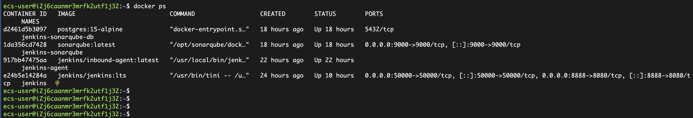
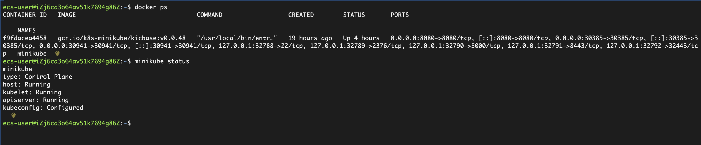
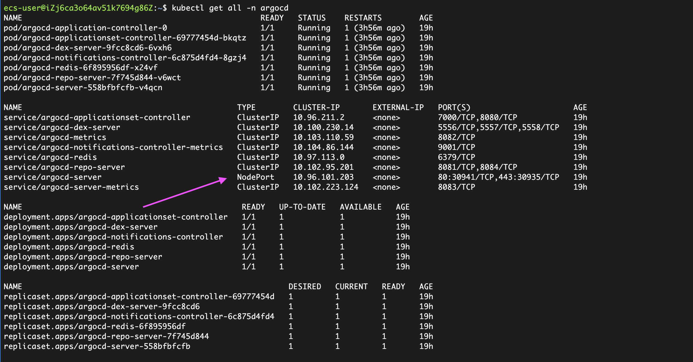
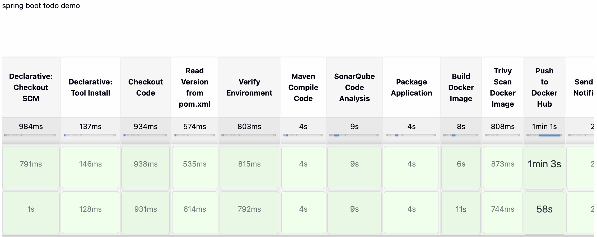
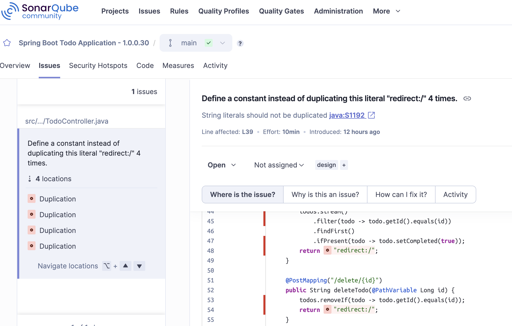

# Spring-boot-todo-app-jenkins-argocd-minikube

In this demo, I will use github and jenkins, argocd, minikube to deploy a spring-boot, maven project todo app, It's just a simple website with mysql database, All I want to do is to show you the CICD process.

Since my free AWS account has been expired, So I will install minikube instead of EKS on Alibaba Cloud ECS server

In this tutorial you will also have a small trip to know Cloud service(Alibaba cloud), docker hub service,docker container services, Kubernetes(minikube), helm charts, sonarqube, database,trivy, public network, private network and DNS and image version control.

I will create all from the very beginning.

## Functional systems

- Github ---- code and helm charts repository

- Jenkins ---- CI Continues Intergration

- ArgoCD  ---- CD Continues Delivery or Continues Deploy

- Kubernets ---- minikube in this tutorial

- Helm charts --- manage the kubernetes apps package

- ...

## Infrastructure prepare

- Alibaba ECS 1 (4 cpus, 8GB memory) with public IP

    - Install jenkins with master and agent node 

    - Install sonarqube as a code scan server

      


- Alibaba ECS 2 (4 cpus, 8GB memory) with Public IP

    - Install minikube 

      

    - Install ArgoCD on minikube (please be noticed the service should be NodePort)

      

## Code structure

- Src part

    - I will use spring boot java as backend and has the REST API for CRUD

    - I will use thymeleaf for forntend java template webpage

- Argocd part

    - The argocd folder will have the application.yaml if you need to create the app using argocd CLI

      ```sh
            apiVersion: argoproj.io/v1alpha1
            kind: Application
            metadata:
            name: spring-todo-app
            namespace: argocd
            finalizers:
                - resources-finalizer.argocd.argoproj.io
            spec:
            project: default
            
            syncPolicy:
                automated:
                prune: true  
                selfHeal: true 
                syncOptions:
                - CreateNamespace=true  
                
                retry:
                limit: 5
                backoff:
                    duration: 5s
                    factor: 2
                    maxDuration: 3m

            source:
                repoURL: https://github.com/pengchao2022/spring-boot-todo-app-jenkins-argocd-minikube.git
                targetRevision: HEAD  
                path: charts/spring-todo-app  
                
                helm:
                valueFiles:
                    - values.yaml
                
                parameters:
                    - name: image.tag
                    value: "latest"  
            
            
            destination:
                server: https://kubernetes.default.svc 
                namespace: todo-app  
            
            # health checks
            ignoreDifferences:
                - group: apps
                kind: Deployment
                jsonPointers:
                    - /spec/replicas
            
            # resource limis
            info:
                - name: description
                value: Spring Boot Todo Application with MySQL
      ```
    - Charts part
        
        - In this folder i will create deployment.yaml including mysql and todo-app, service.yaml and values.yaml files

          Since this is not EKS, minikube is for a local environment i will not use ingress and alb services.

## Jenkins CI 

- The jenkins will do the continuing intergration

- Here's the pipeline stage overview

 

 - I use sonarqube to scan the code after maven compiled and here's the issues found

 
 


