# Spring-boot-todo-app-jenkins-argocd-minikube

In this demo, I will use github and jenkins, argocd, minikube to deploy a spring-boot, maven project todo app, It's just a simple website with mysql database, All I want to do is to show you the CICD process.

Since my free AWS account has been expired, So I will install minikube instead of EKS on Alibaba Cloud ECS server

In this tutorial you will also have a small trip to know Cloud service(Alibaba cloud), docker hub service,docker container services, Kubernetes(minikube), helm charts, sonarqube, database,trivy, public network, private network and DNS and image version control and security policy governance strategies.

I will create all from the very beginning.

## CI-CD Architecture

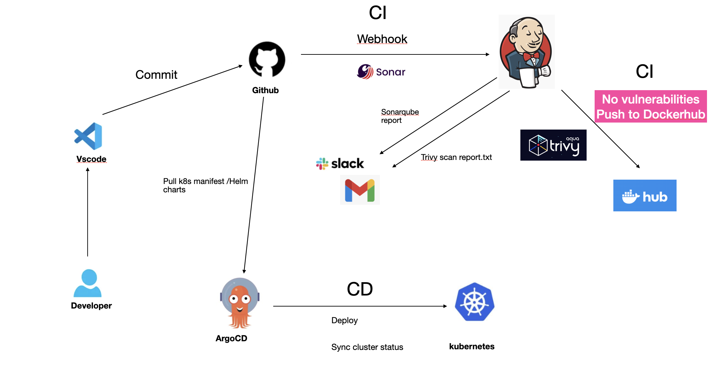

## Functional systems

- Github ---- code and helm charts repository

- Jenkins ---- CI Continues Intergration

- ArgoCD  ---- CD Continues Delivery or Continues Deploy

- Kubernets ---- minikube in this tutorial

- Helm charts --- manage the kubernetes apps package

- Docker hub  ---- image registry

- ...

## Infrastructure prepare

- Alibaba ECS 1 (4 cpus, 8GB memory) with public IP

    - Install jenkins with master and agent node 

    - Install sonarqube as a code scan server

      


- Alibaba ECS 2 (4 cpus, 8GB memory) with Public IP

    - Install minikube 

      

    - Install ArgoCD on minikube (please be noticed the service should be NodePort)

      

## Code structure

- Src part

    - I will use spring boot java as backend and has the REST API for CRUD

    - I will use thymeleaf for frontend java template webpage

- Argocd part

    - The argocd folder will have the application.yaml if you need to create the app using argocd CLI

      ```sh
            apiVersion: argoproj.io/v1alpha1
            kind: Application
            metadata:
            name: spring-todo-app
            namespace: argocd
            finalizers:
                - resources-finalizer.argocd.argoproj.io
            spec:
            project: default
            
            syncPolicy:
                automated:
                prune: true  
                selfHeal: true 
                syncOptions:
                - CreateNamespace=true  
                - PruneLast=true           # first create new resources, then delete old ones
                - ApplyOutOfSyncOnly=true  # sync only resources that are out-of-sync
                - RespectIgnoreDifferences=true 
                
                retry:
                limit: 5
                backoff:
                    duration: 5s
                    factor: 2
                    maxDuration: 3m

            source:
              repoURL: https://github.com/pengchao2022/spring-boot-todo-app-jenkins-argocd-minikube.git
              targetRevision: HEAD  
              path: charts/spring-todo-app  
                
                helm:
                valueFiles:
                    - values.yaml
                
                parameters:
                    - name: image.tag
                    value: "latest"  
        
            destination:
              server: https://kubernetes.default.svc 
              namespace: todo-app  
            
            ignoreDifferences:
                - group: apps
                kind: Deployment
                jsonPointers:
                    - /spec/replicas

            info:
                - name: description
                value: Spring Boot Todo Application with MySQL
      ```
    - Charts part
        
        - In this folder i will create deployment.yaml including mysql and todo-app, service.yaml and values.yaml files

          Since this is not EKS, minikube is for a local environment i will not use ingress and alb services.

## Jenkins CI 

- The jenkins will do the continuing intergration

- Here's the pipeline stage overview

 

 - I use sonarqube to scan the code after maven compiled and here's the issues found

 

- Install trivy and jq on jenkins-agent 
  ```shell
  docker exec -it jenkins-agent /bin/bash

  sudo apt-get install -y trivy
  sudo apt install -y jq

  ```
 
- I installed trivy on jenkins-agent so that it can scan the image vulnerabilities before I push to docker hub

  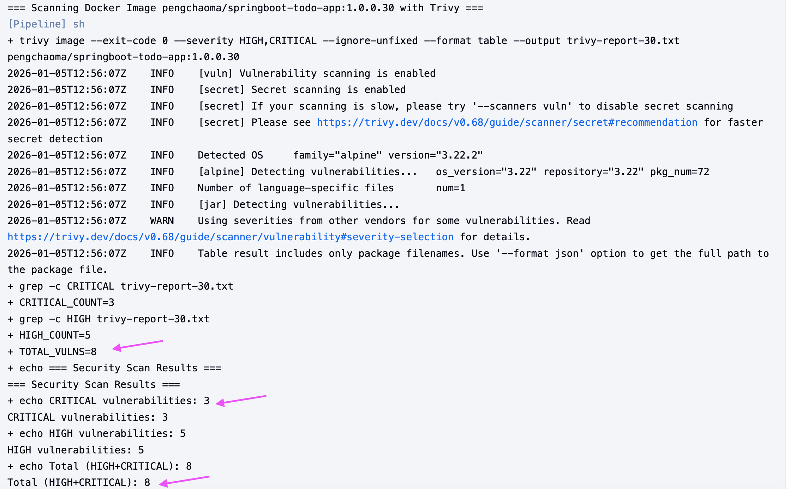

- Normally, you can find the trivy scan report in your jenkins-agent directory

  ```sh
  /home/jenkins/agent/workspace/springboot-todo-ci-demo
  ```
 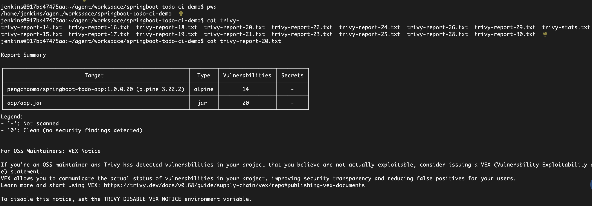

- For a CICD pipleline I'd like to highlight sth about trivy
  when you set --exit-code = 0 like this :
  ```shell
  trivy image --exit-code 0 myimage:latest
  ```
  then whenever the images has vulnerabilities or not , the CICD piple line will continue, without failure
  So In a Production or Development environment , we should define pipleline like this:
  ```shell
  trivy image \
  --severity HIGH,CRITICAL \
  --ignore-unfixed \
  --format table \
  --output trivy-report.txt \
  myimage:latest
  ```
  In this case, whenever High or critical vulnerabilities found, the CICD pipleline will be interrupted and you have to fix the issues before you can continue, a report will also been generated.

- If we want to set the security policy to 0 Critical, 1 High then pipeline can be continued
  we should write the jenkins pipleline with if else statement:
  ```shell
  pipeline {
    
    
    tools {
        // make sure trivy and jq have been installed on the jenkins agent
    }
    
    environment {
        IMAGE_NAME = 'myimage:latest'
    }
    
    stages {
        stage('Trivy scan images') {
            steps {
                script {
                    // run trivy and generate the json report
                    sh '''
                        trivy image \
                            --severity HIGH,CRITICAL \
                            --ignore-unfixed \
                            --format json \
                            --output trivy-report.json \
                            ${IMAGE_NAME}
                    '''
                    
                    // get the vulnerabilities from json
                    def trivyReport = readJSON file: 'trivy-report.json'
                    
                    // count the number
                    def criticalCount = 0
                    def highCount = 0
                    
                    // Iterate through all results 
                    trivyReport.Results?.each { result ->
                        result.Vulnerabilities?.each { vuln ->
                            if (vuln.Severity == "CRITICAL") {
                                criticalCount++
                            } else if (vuln.Severity == "HIGH") {
                                highCount++
                            }
                        }
                    }
                    
                    echo "security report："
                    echo "  CRITICAL vulnerability number: ${criticalCount}"
                    echo "  HIGH vulnerability number: ${highCount}"
                    
                    // Check the condition
                    if (criticalCount == 0 && highCount == 1) {
                        echo "security passed：（CRITICAL=0，HIGH=1）"
                    } else {
                        error("security failed：CRITICAL=${criticalCount}，HIGH=${highCount}。the security policy requires：CRITICAL=0，HIGH=1")
                    }
                }
            }
        }
        
        stage('next step') {
            steps {
                echo "security scan pssed, you can continue your next step"
                // the follwoing step...
            }
        }
    }
    
    post {
        always {
            // save the trivy-report.json file
            archiveArtifacts artifacts: 'trivy-report.json', fingerprint: true
        }
    }
  }
  ```


- Image security Policy and Strategy

  - production environment

    - No Critical vulnerabilities 
    - No High vulnerability requires assessment
    - Medium and Low severity vulnerabilities pose relatively low risk in build images


- I use the Semantic version control, you can see in my docker hub the image tags

  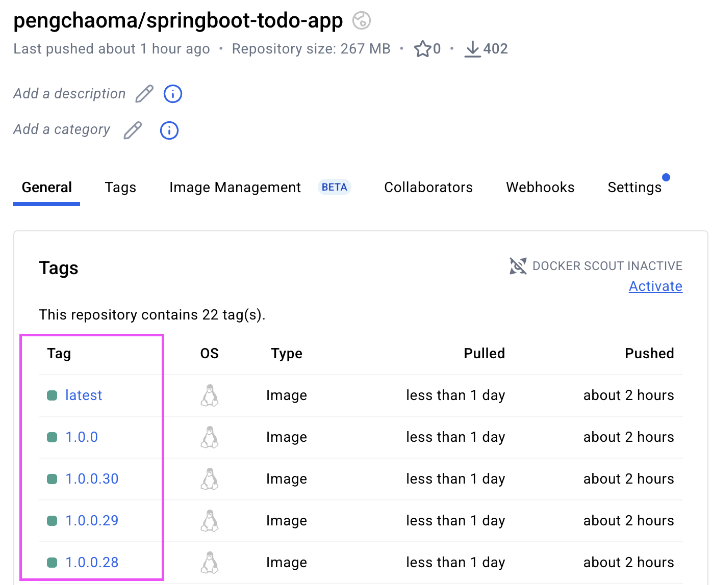

  - latest	Latest Stable Version	Default tag, always points to the most recent successful build

  - 1.0.0	Major Version Number	Stable release version

  - 1.0.0.30	Build Number	The 30th build (specific version)

- version control and tags classification

   - Different tags represent different use cases, release stages, and governance strategies

   - latest is most active and used for a development environment

   - 1.0.0  is stable version used for a production environment

   - 1.0.0.30 30 is the jenkins build number and is used for a test environment


- I have also set up the email notification, When the jenkins finished the CI
  (since I don't have slack or sth then just use email instead)

  

  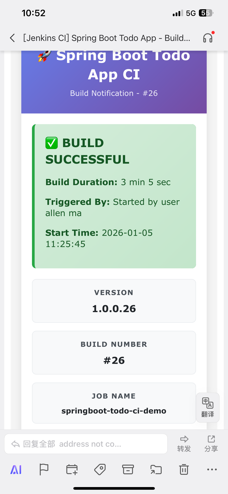

- the email content will also include the trivy vulnerabilities information

  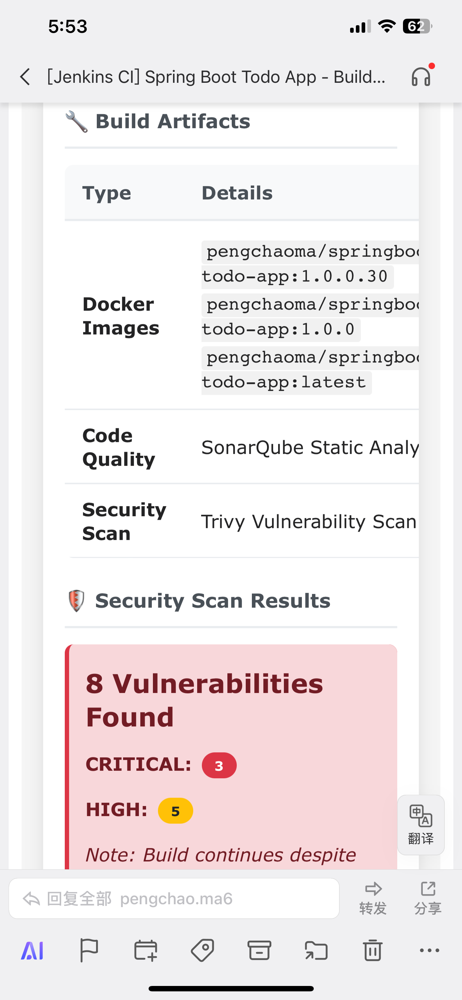
  

## ArgoCD

- You can use argocd cli or just use argocd UI to create the todo-app

  - For argocd cli create app you need to run:

    ```shell
       argocd app create -f application.yaml
    ```

   - click "New App"

   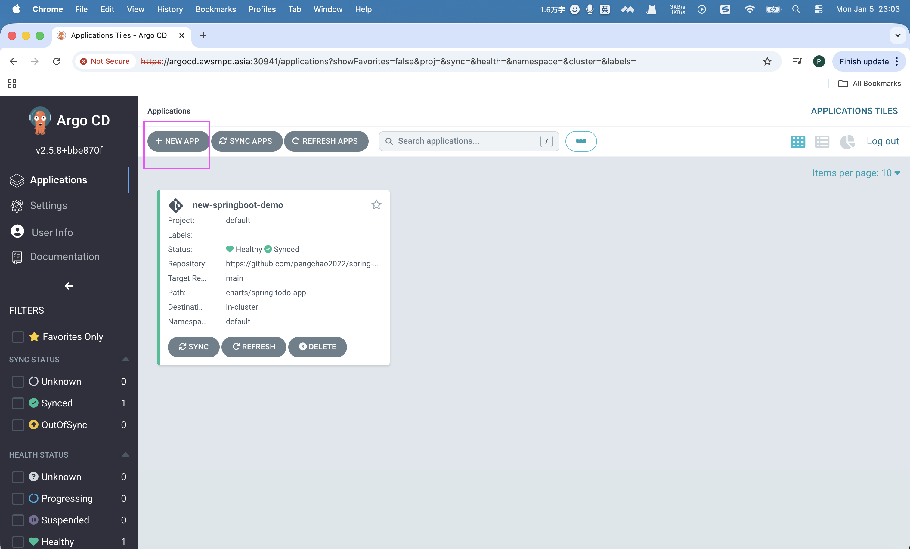

- fill in the github repo and select the helm charts directory

   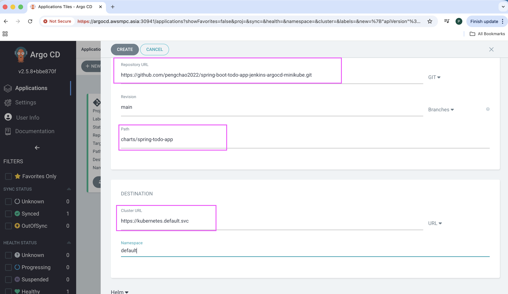

- After few seconds you can see the app is ready

   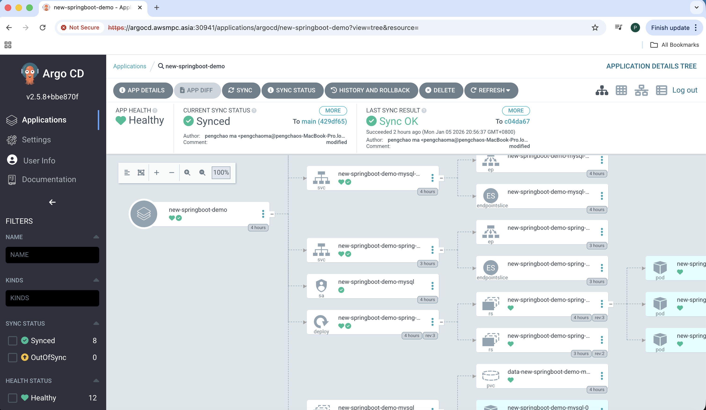

- Check pods and services in minikube

   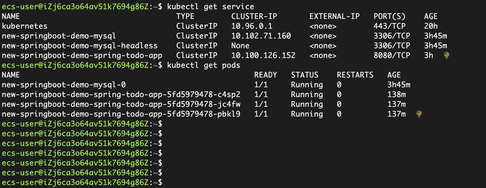

- Use the kubectl port-forward to access the todo-app outside of minikube

```shell
   kubectl port-forward --address 0.0.0.0 deployment/new-springboot-demo-spring-todo-app 31260:8080 &
```

- here's the todo-app runs like
  
  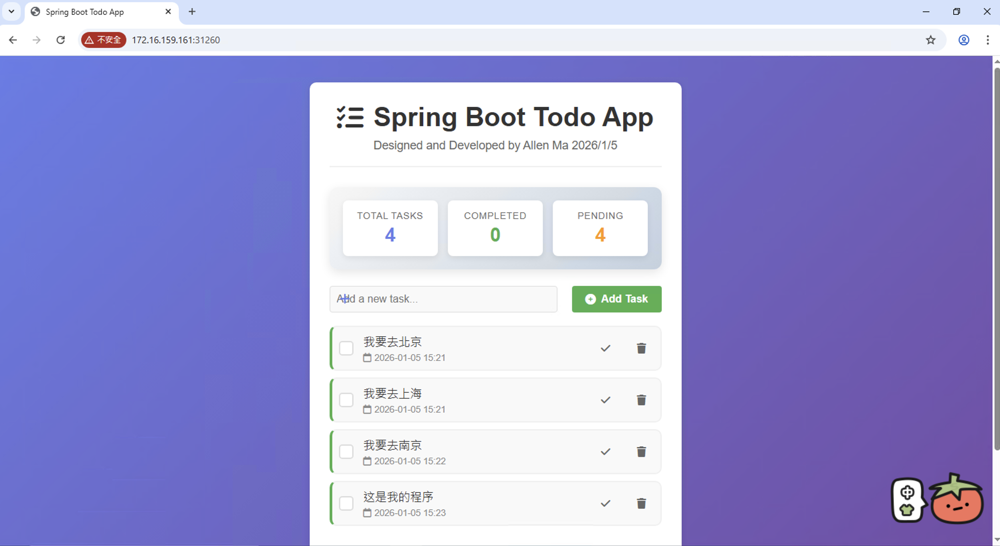


## Multiple environment deployment

- If you need to deploy different environments using Argocd for example, like dev, prod, stage... It's also easy to finish 

  with the help of ArgoCD

  - firstly created a new directory in your charts folder for example named charts/spring-todo-app-prod and copy the     
  
    existed charts, values, templates to this folder

  - create a new App in argocd and select the path to "charts/spring-todo-app-prod"

  - modify the image tags in values.yaml file

  ```shell
    
     image:
       repository: pengchaoma/springboot-todo-app
       pullPolicy: Always
       tag: "1.0.0"  # you needs to change the latest to 1.0.0 and this is the stable version using for a Prod environment
  ```
  - If you don't want to create another path directory and you can also define different environment by different values.yaml files in your existed directory

  - For example:

    - values-dev.yaml   ---- image: "latest"
    - values-prod.yaml  ---- image: "1.0.1"
    - values-test.yaml  ---- image: "1.0.1.30"

## Application upgrade or rollback

- If you need to upgrade your application for example from app:1.0.1 to app:1.0.2 ,I have written the Continuous rolling  

updates without traffic interruption
```shell
strategy:
    type: RollingUpdate
    rollingUpdate:
      maxSurge: {{ .Values.deployment.maxSurge | default 1 }}
      maxUnavailable: {{ .Values.deployment.maxUnavailable | default 0 }}
  
```
- when you change the image version in values.yaml from 1.0.1 to 1.0.2 and git a commit then push the code
```shell
image:
  repository: pengchaoma/springboot-todo-app
  pullPolicy: Always
  tag: "1.0.2"
```
the argocd will automatically sync the change to k8s and new pods will be created in kubernetes automatically without 

traffic interrupt


- Thanks for Reading my demo 


- Develped by Pengchao Ma @2026.1.6

   


